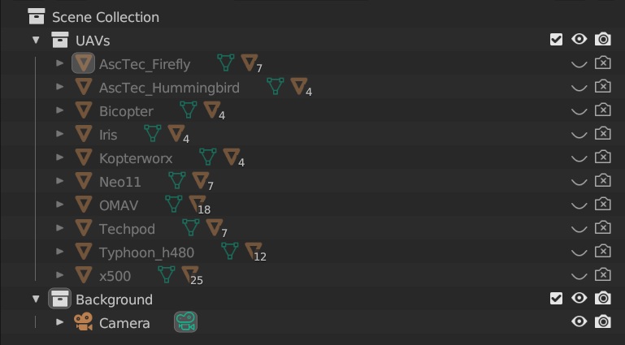
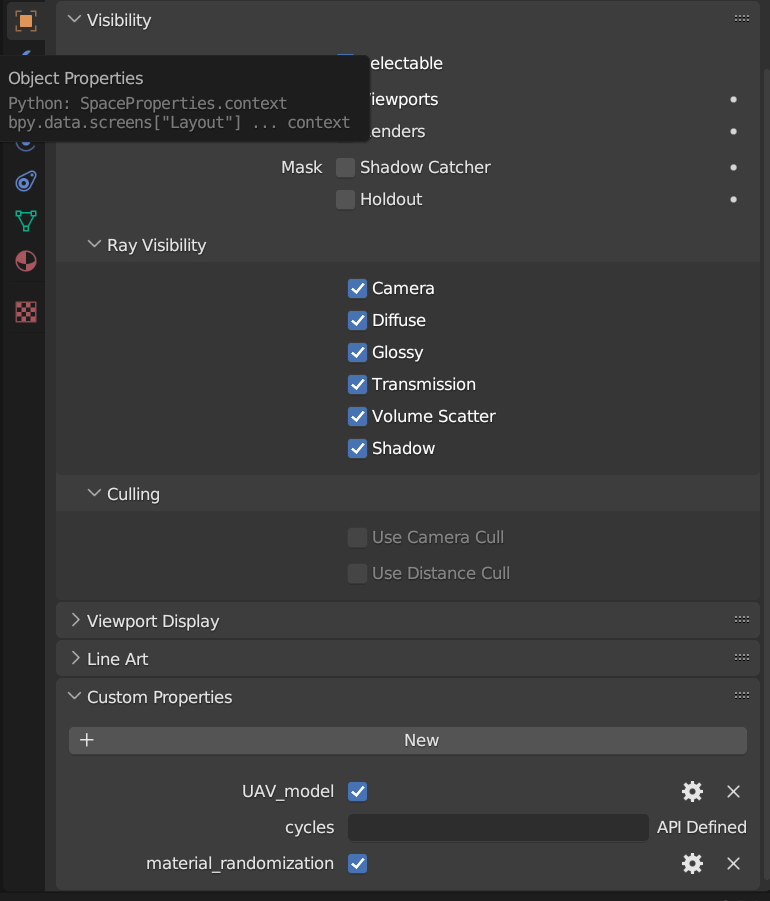

# UAV generation in blender
In this section, we introduce the system design for randomization.

## Requirements
* 

## Model properties

## 

## Model

### Custom properties

- UAV_model: boolean, is it a UAV model? (ancestor of model parts only)
    - Defaults to False if not specified.
- material_randomization: Union[boolean, List[boolean]], randomization for its material slots
    - Defaults to True if not specified.
    - If it is a list of boolean, the length must be equal to the number of material slots.
- group_name: Union[str, List[str]], the part belongs to the specific group.
    - The material slot will be seen as an individual group if it is not specified.
    - If it is a list of str, the length must be equal to the number of material slots.
- visibility: boolean, the visibility of the object
    - Defaults to True if not specified.

### Random logic (material)

1. randomly sample an euler angle
2. group by group_name
3. filter with material_randomization
4. sample a material from materials which random_material is True.
    - ~~if color_only, then randomly generate a RGB value and set to the Base Color of Principled BSDF.~~
5. apply it to all parts

## Material

### Custom properties

- random_material: boolean, is it one of the materials for randomization?
    - Defaults to False if not specified.
- ~~color_only: boolean, is it a material with color only (no texture)?~~
    - ~~Defaults to False if not specified.~~

## Blender output

- Generate the foreground image (resized UAV models) with the same size as the background
    - Use the alpha channel as a mask.
    - Steps
        - Create a black RGB image with the same size as the background
        - Use Image.paste to paste UAV to the corresponding position
            - **Lanczos**
        - Convert to RGBA (save as png directly)
